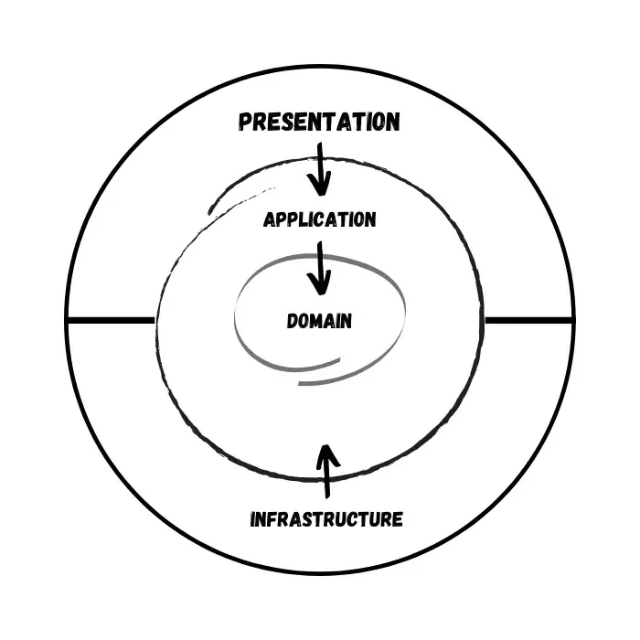

# User Management System - Itransition Task 5

Professional web application for user management with authentication, authorization, and email verification.

## Features

- User registration with email verification
- JWT-based authentication
- User management (block, unblock, delete operations)
- Admin panel with bulk operations
- Email verification via SendGrid
- Responsive Bootstrap UI
- PostgreSQL database with unique email constraint
- Real-time user status checking

## Tech Stack

### Backend
- ASP.NET Core 8.0 Web API
- PostgreSQL + Entity Framework Core
- JWT Bearer Authentication
- SendGrid Email Service
- BCrypt Password Hashing

### Frontend
- Next.js 14 (App Router)
- React + TypeScript
- Bootstrap 5 + React Bootstrap
- Axios HTTP Client
- React Toastify Notifications

## Prerequisites

- [.NET 8.0 SDK](https://dotnet.microsoft.com/download)
- [Node.js 18+](https://nodejs.org/)
- [PostgreSQL 14+](https://www.postgresql.org/)
- [SendGrid Account](https://signup.sendgrid.com/)

## Local Development

### 1. Database Setup
```sql
CREATE DATABASE ItransitionTask5;
```

### 2. Backend Setup
```bash
cd backend

# Copy template and configure
cp ItransitionTask5.API/appsettings.template.json ItransitionTask5.API/appsettings.json

# Edit appsettings.json with:
# - PostgreSQL connection string
# - JWT secret key (32+ characters)
# - SendGrid API key
# - Verified sender email

# Restore and run migrations
dotnet restore
dotnet ef database update --project ItransitionTask5.Persistence --startup-project ItransitionTask5.API

# Start API
dotnet run --project ItransitionTask5.API
```
API runs on: > http://localhost:5014

### 3. Frontend Setup

```bash
cd frontend

# Install dependencies
npm install

# Start dev server
npm run dev
```

App runs on: > http://localhost:3000

### SendGrid Configuration

 1. Create SendGrid account
 2. Verify sender email (Settings → Sender Authentication)
 3. Create API key (Settings → API Keys → Full Access)
 4. Add API key to appsettings.json

## Environment Variables
### Backend

| Variable  | Description |
| ------------- | ------------- |
| ConnectionStrings__ApplicationDbContext  | PostgreSQL connection  |
| JwtSettings__SecretKey  | JWT secret (32+ chars)  |
| SendGridSettings__ApiKey  | SendGrid API key  |
| SendGridSettings__FromEmail  | Verified sender email  |
| SendGridSettings__VerificationUrl  | Frontend verification URL  |

Example of .env file

```bash
ConnectionStrings__ApplicationDbContext=<POSTGRES_INTERNAL_URL>
JwtSettings__SecretKey=<GENERATE_32CHAR_KEY>
JwtSettings__Issuer=ItransitionTask5API
JwtSettings__Audience=ItransitionTask5Client
JwtSettings__ExpirationMinutes=60
SendGridSettings__ApiKey=<SENDGRID_KEY>
SendGridSettings__FromEmail=<VERIFIED_EMAIL>
SendGridSettings__FromName=ItransitionTask5
SendGridSettings__VerificationUrl=https://<FRONTEND_URL>.onrender.com/verify-email
ASPNETCORE_ENVIRONMENT=Production
ASPNETCORE_URLS=http://+:$PORT
```

### Frontend
| Variable  | Description |
| ------------- | ------------- |
| NEXT_PUBLIC_API_URL | Backend API URL  |

Example of .env file
```bash
NEXT_PUBLIC_API_URL=https://<BACKEND_URL>/api
```

## API endpoints

### Public

+ `POST /api/auth/register` - Register user
+ `POST /api/auth/login` - Login
+ `GET /api/auth/verify-email` - Verify email

### Protected (requires JWT)
+ `GET /api/user` - Get all users
+ `POST /api/user/block` - Block users
+ `POST /api/user/unblock` - Unblock users
+ `POST /api/user/delete` - Delete users
+ `POST /api/user/delete-unverified` - Delete unverified

## Database Schema

```sql
CREATE TABLE "Users" (
    "Id" uuid PRIMARY KEY,
    "Name" text NOT NULL,
    "Email" text NOT NULL,
    "Position" text NOT NULL,
    "PasswordHash" text NOT NULL,
    "RegistrationTime" timestamptz NOT NULL,
    "LastLogin" timestamptz,
    "Status" text NOT NULL
);

CREATE UNIQUE INDEX "IX_Users_Email" ON "Users" ("Email");
```

## Project Structure

In this case for Backend I used "Onion Architecture"



This architecture increases security and maintainability.

```
ItransitionTask5/
├── backend/
│   ├── ItransitionTask5.API/          # Controllers, middleware
│   ├── ItransitionTask5.Application/  # Business logic
│   ├── ItransitionTask5.Core/         # Domain models
│   └── ItransitionTask5.Persistence/  # Data access
├── frontend/
│   ├── app/                           # Next.js pages
│   ├── components/                    # React components (UI)
│   ├── contexts/                      # Auth / global state contexts
│   └── services/                      # API service calls (Axios)
└── README.md
```

## Links

To preview how the project works, you can view it here: [streamable](https://streamable.com/7hn4or)  
*Video was recorded on a local machine.*
